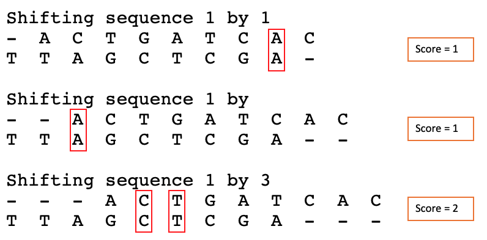
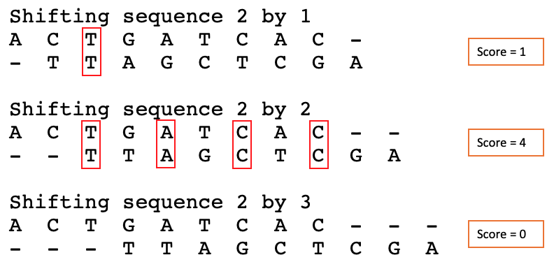

# INF 502 - PA1
Programming Assignment 1 for INF 502.

This assignment will give you some practice with basic Python structures, file input and output, 
and exceptions in the context of writing a basic encryption program that implements the Caesar cipher. 

I hope you enjoy dealing with the assignment. We will deal with two dummy problems in this assignment, which you will have discuss at the end

## DNA Similarity
Measuring the similarity betweenn different sequences of DNA may tell us how related the owners of those sequences are. 

A molecule of DNA consists of two chains made up of repeating subunits called nucleotides. There are four different types of nucleotides in DNA: adenine (A), thymine (T), guanine (G), and cytosine (C) [1]. Programmatically, DNA we can have represent it as a string, where each character must be one of A, G, C, or T.

To measure similarity, I am making up two nice and simple metrics

**NUMBER OF MATCHES:** for the first one, we will compare the alignment between two sequences of DNA checking each position. Most probably there are better ways of assessing DNA similarity, but we will use this as a case for our programming assignment. 
By aligning the sequences pairwise, we will see the number of matches, for example:

In the case of the figure we have three matches (highlighted in red) and 6 mismatches. The result score is -3 (+3 for the matches -6 for the mismatches).

However, one thing to have in mind is that each sequence may have insertions or deletions to form a better alignment (but we cannot reorder any sequence). In other words, we can shift nucleotides as long as the order is the same. **For this assignment we will only attempt to shift the complete sequence, without considering insertions or deletions in the middle of the sequence.** By shifting a sequence by one it is possible to verify if we get better results than other previous configurations. The maximum shift (number of insertions in the beginning of a sequence) may be either explicitly set by the user or left to the algorithm to decide when it is not possible to get a better score.  For example, if the user considers a maximum shift of 3, these will be the possibilities:

## Assignment, Part 1: Implementing the Similarity algorithm described above

You can decompose the algorithm into functions however you like, and it would be really beneficial to you if you spent some time planning out what that decomposition should look like. Your program has to fulfill the following requirements:

* 

1. http://knowgenetics.org/dna-and-proteins/
